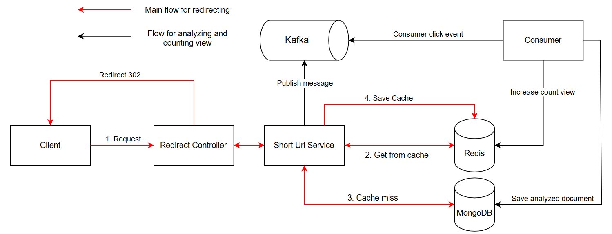

# T-Shorten-Url

A highly scalable and performant URL shortener service built with modern Java and Spring Boot.

## 1. Workflow

## 2. Tech Stack

- **Java 21**: The primary programming language, leveraging modern features and enhancements.
- **Spring Boot**: The core framework for building robust and standalone REST APIs.
- **MongoDB**: A NoSQL database for flexible and scalable data persistence (integrated via Spring Data MongoDB).
- **Redis**: An in-memory data store used for fast caching, rate limiting, and distributed locking (integrated via Spring Data Redis).
- **Apache Kafka**: A distributed event streaming platform used to handle high-throughput, asynchronous processing (integrated via Spring Kafka).

## 3. Key Techniques & Architecture

- **Distributed Snowflake ID Generation**: Implements a custom 64-bit ID generator based on Twitter's Snowflake algorithm (`SnowflakeIdGenerator`). This ensures the highly available, decentralized generation of unique IDs for short URLs without requiring database round-trips or risking collisions.
- **Write-Behind Caching Strategy**: To optimize database write performance, URL view counts are rapidly incremented in the Redis cache. A scheduled background job (`ShortUrlSchedule`) periodically flushes and synchronizes these aggregated view counts from Redis to MongoDB in batches, significantly reducing database write pressure.
- **Distributed Locking**: Implements a Redis-based distributed lock mechanism (`DistributeLockService`) to safely coordinate shared resources and prevent race conditions when running multiple instances of the application in a clustered environment.
- **Resilient Message Processing**: Leverages Kafka's `@RetryableTopic` and Dead Letter Topics (DLT) to gracefully handle transient failures during event consumption, ensuring no analytics data is lost.
- **Cache Penetration Prevention**: Protects the database from malicious attacks requesting non-existent URLs. If a short URL is not found in the database, an empty string is cached with a short TTL (5 minutes). Subsequent requests for the same non-existent URL will hit the cache and fail fast, avoiding unnecessary database queries.
- **Cache Breakdown & Avalanche Prevention**: 
  - To prevent **Cache Breakdown** (when a highly accessed "hot" key expires), a distributed lock is used before querying the database. This ensures only a single thread rebuilds the cache while others wait and retry reading from the cache, protecting the database from a sudden spike in load.
  - To prevent **Cache Avalanche** (when many keys expire simultaneously), a random jitter (up to 5 minutes) is added to the base cache TTL (24 hours), distributing the expiration times evenly.